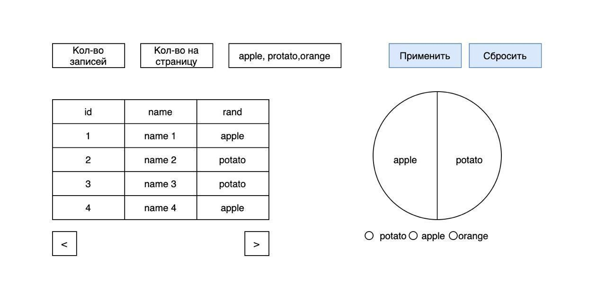

> Тестовое задание для компании Escalate и Atomicwallet.io (https://pangeoradar.ru/)

## # Задача

Схематическая картинка того, что должно получиться:



Пример данных:

```json
[
  { "id": 1, "title": "name1", "rand": "apple" },
  { "id": 2, "title": "name2", "rand": "tomato" },
  { "id": 3, "title": "name3", "rand": "potato" },
  { "id": 4, "title": "name4", "rand": "orange" }
]
```

Задача:

На странице должны быть отрисованы форма, таблица и график (круговая диограмма).

1. Таблица должна поддерживать сортировку столбцов и пагинацию.
   Кол-во строк в таблице должны задаваться в форме.

2. Форма представленна в виде трех полей:

- Кол-во записей для генерации
- Кол-во строк на страницу для вывода
- Перечисленные через запятую слова участвующие при заполнении поля rand в данных

Изменения применяются по кнопке, также нужно отрисовать кнопку сброса значений на дефолтные.

При нажатии на кнопку применения значений, код должен сгенировать рандомные данные согласно указанным значениям и отрисовать их с таблице.
Диаграмма должна отрисовывать общее кол-во строк для уникальных полей rand в сгенеренных данных.

Задание под звездочкой:

- Предусмотреть валидацию полей
- Предусмореть экспорт отфильтрованных данных в csv
- Предусмореть изменение вида диаграммы на стоблчатую

Требования к релиазации:

- vuejs 2/3
- bootstrap
- любая знакомая библиотека для отрисовки графиков
- git (результат желательно залить на гитхаб, либо прислать в виде архива, но с наличием истории изменений в виде коммитов)

## # Системные требования

|      | Версия     | Рекомендация |
| ---- | ---------- | ------------ |
| node | `>=` 14.19 | 14.19.0      |
| npm  | `>=` 6.14  | 6.14.16      |

## # Команды

|     | Команда                    | Описание                      |
| --- | -------------------------- | ----------------------------- |
| 1   | npm install                | Установка пакетов для проекта |
| 2   | npm run dev                | Сервер разработки             |
| 3   | npm run build              | Сборка проекта для прода      |
| 4   | npm run lint:script        | eslint                        |
| 5   | npm run lint:script-fix    | eslint --fix                  |
| 6   | npm run lint:script-format | prettier                      |
